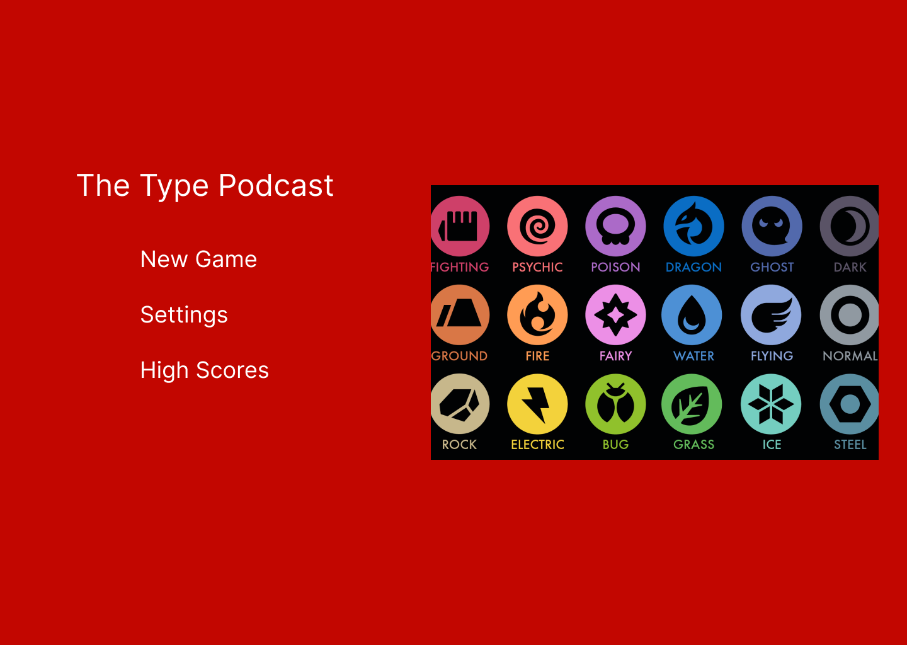

# The Type Podcast

## Overview

It is a mini game that quizzes the player on their knowledge of the pokemon type chart. Players will be given a type or type combination that they currently are on a particular level. In the level there will be 2 layers one for attacking and one for defending, the player will be given 3 type options, on the attacking stage they must choose the type that they will deal the most damage against or that they are super effective against. On the defending stage the player must choose the type that they will take the least amount of damage from. Consecutive correct answers will give the player a multiplier to their score

### Problem Space

My problem space is that the pokemon typechart has become convoluted as time has gone on and new types and type combos have been added. So I want to make a little mini game to quickly test your knowledge without having to play through entire games and encounter every pokemon so that they don't feel as if they've been thrown into the deepend when returning to play.

### User Profile

I would say anyone interested in pokemon, but more specifically players new to the series or returning players who haven't played since some of the earlier games as they're not as well practiced as to all the type matchups in the games.

### Features

- Get a random type for the player on rendering the level
- Get types that the player is super effective, neutral, not very effective or immune against and types that are the aforementioned against the player as well.
- Check if the choice the user makes is correct or incorrect.
- Scoring system with multiplier for consecutive correct answers.
- Lives for the player so they don't lose on 1 incorrect answer.
- Home Screen with Play and High Scores options.
- High Scores Screen that displays around 5 top scores with the players name

## Implementation

### Tech Stack

- React
- Javascript
- MySQL
- Express
- Unity
- Client Libraries:
  - react
  - react-router
  - axios
  - react-unity-webgl
- Server Libraries:
  - knex
  - express

### APIs

- PokeAPI

### Sitemap

- Home Page
- In-game level
- in-game Pause
- victory screen
- defeat screen
- high scores page

### Mockups

#### Home Page



#### In-Game Level


#### In-Game Pause


#### Victory Screen


#### Defeat Screen


#### High Scores Page


### Data

Describe your data and the relationships between the data points. You can show this visually using diagrams, or write it out.

### Endpoints

GET /type

- Returns array of all types

- Parameters:
- None

Response:
```
[
    {

        name: "normal",
        url: "https://pokeapi.co/api/v2/type/1/"

    },
    ...
]
```

GET /type/:id

- Returns all information needed about a specific type

Parameters:

- Pokemon type

Response:
```
[
    {

        damage_relations: {},

        sprites: {},

    },
    ...
]
```

GET /type/:id/relationships

- Makes a call to pokeAPI that returns an array of the damage relationships for given types

Parameters:

- Pokemon type

Response:

```
[
    {
        no_damage_to: [A list of types this type has no effect on],

        half_damage_to: [A list of types this type is not very effect against],

        double_damage_to: [A list of types this type is very effect against],

        no_damage_from: [A list of types that have no effect on this type],

        half_damage_from: [A list of types that are not very effective against this type],

    },
    ...
]
```

GET /highscores

Returns a list of high scores from the database

Parameters:

- none

```
[
    {
        id: unique string,

        username: string,

        score: number

    },
    ...
]
```

POST /highscores

Posts a new high score to the list

Parameters:

- username
- new score

```
[
    {
        id: unique string,

        username: string,

        score: number

    },
    ...
]
```

## Roadmap

- Create client
    - react project with routes and boilerplate pages

- Create server
    - express project with routing, with placeholder 200 responses

- Create Migrations

- Create 5 fake scores and usernames to use as seeds to populate table

- Deploy client and server projects so all commits will be reflected in production

- Feature: Build basic Unity level with game logic.
    - Create Unity stage to host our level
    - Implement user movement


- Feature Core Gameplay loop
    - Create function to set user type
    - Create function to set attacking and defending types
    - Create checks for correct and incorrect answers
    - Create on level end and load handlers
    - Create game over state to send

- Feature connect game to my React App.
    - Using the React Unity WebGL sendMessage function to tell the game information for the level
    - Using UseEffect in combination with eventListeners to handle level respawns or game over states.


- Feature Home Page

- Feature High Scores Page
    - Implement scoring system in Unity with multipliers
    - Post scores when they're returned from game over state
    - Get scores and display a filtered list of the top scores

- Feature Player lives
    - Implement player lives to extend the gameplay and give players more opportunities

- Bug fixes

- Demo Day

---

## Future Implementations/Nice-to-haves

- Implement ability to handle dual types for the player to more closely simulate pokemon
- Settings menu with custom keybinds and audio settings
- Utilize pokemon sprites to better help visualize what pokemon are which types while they play
- User accounts and authentication